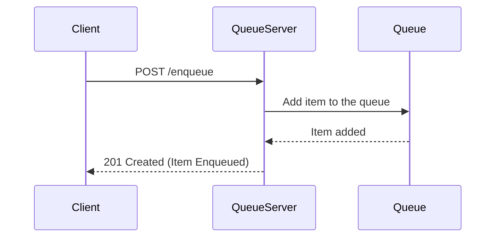
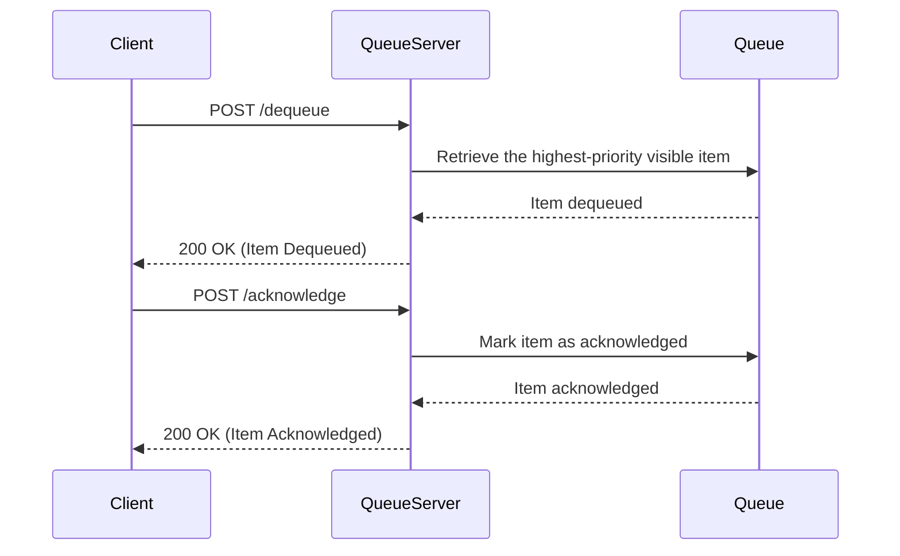

## Overview
This is a simple in-memory **Queue Service** built in **Go**. It allows you to create multiple queues, enqueue items with priority, dequeue items (with visibility timeout), and acknowledge their processing. The queue follows a producer-consumer pattern where messages are dequeued by consumers, processed, and then acknowledged to remove them from the system.

The service is thread-safe and supports concurrent access, making it suitable for use in environments where multiple clients interact with the same queue.

---

### **Table of Contents**
- 🌟 [Features](#features)
- 🏗️ [Architecture Overview](#architecture-overview)
- 📊 [Diagrams](#diagrams)
- 🛠️ [Installation](#installation)
- 📖 [Usage](#usage)
- 📡 [Refined API Structure](#refined-api-structure)
- 🧩 [API Design Diagrams](#api-design-diagrams)
- 📝 [Example cURL Commands](#example-curl-commands)
- ✅ [Conclusion](#conclusion)
- 🔄 [Concurrency](#concurrency)
- 📜 [License](#license)

---

### Features
- **Multiple Queue Support:** Each queue is identified by a unique name.
- **Priority Queue:** Items in the queue can have a priority, and higher priority items are dequeued first.
- **Visibility Timeout:** After a message is dequeued, it is invisible for a set period (default: 10 seconds) until acknowledged.
- **In-Flight Items:** Tracks items that are currently being processed but have not yet been acknowledged.
- **Acknowledgment:** Ensures that once a message is processed, it is removed from the queue and cannot be processed again.

---

### Architecture Overview

1. **QueueItem**:
   - Represents a single item in the queue.
   - Has properties such as ID, Payload, Priority, visibility timeout, and acknowledgment status.

2. **Queue**:
   - Maintains the list of `QueueItems`.
   - Manages in-flight items that have been dequeued but not yet acknowledged.
   - Uses a priority heap to ensure high-priority items are dequeued first.

3. **QueueServer**:
   - Manages multiple `Queue` instances.
   - Handles requests to create queues, enqueue/dequeue items, and acknowledge items.
   - Uses channels to process client requests concurrently.

---

### Diagrams

#### **Lifecycle Architecture Diagram**


---

### Installation

1. Clone the repository:
   ```bash
   git clone https://github.com/yourusername/go-queue-service.git
   cd go-queue-service
   ```

2. Install dependencies:
   ```bash
   go mod tidy
   ```

---

### Usage

#### 1. Creating a Queue
```go
queueServer := queue_server.NewQueueServer(logger)
_, err := queueServer.CreateQueue("myQueue")
if err != nil {
    log.Fatal("Failed to create queue:", err)
}
```

#### 2. Enqueue an Item
```go
item := queue.NewQueueItem("item1", "payload")
_, err := queueServer.Enqueue("myQueue", item)
if err != nil {
    log.Fatal("Failed to enqueue item:", err)
}
```

#### 3. Dequeue an Item
```go
item, err := queueServer.Dequeue("myQueue")
if err != nil {
    log.Fatal("Failed to dequeue item:", err)
}
fmt.Println("Dequeued item:", item)
```

#### 4. Acknowledge an Item
```go
_, err := queueServer.Acknowledge("myQueue", "item1")
if err != nil {
    log.Fatal("Failed to acknowledge item:", err)
}
```

### **Refined API Structure**

---

#### **1. Enqueue Item**

- **Endpoint**: `/queues/{queueName}/enqueue`
- **Method**: `POST`
- **Request Body**:
  ```json
  {
    "item": {
      "id": "3",
      "payload": "{'name': 'Lorem Ipsum', 'email': 'loremipsum@gmail.com'}",
      "priority": 5
    }
  }
  ```
  - **queueName**: The name of the queue to which you are adding the item.
  - **item**:
    - **id**: A unique identifier for the queue item.
    - **payload**: The data that needs to be processed (in JSON format).
    - **priority** (optional): Specifies the priority of the item, defaults to `1` if not provided.

- **Response**:
  - **Status Code**: `201 Created`
  ```json
  {
    "status": "success",
    "message": "Item enqueued successfully",
    "item": {
      "id": "3",
      "payload": "{'name': 'Lorem Ipsum', 'email': 'loremipsum@gmail.com'}",
      "priority": 5
    }
  }
  ```

---

#### **2. Dequeue Item**

- **Endpoint**: `/queues/{queueName}/dequeue`
- **Method**: `POST`
- **Request Body**: None
- **Response**:
  - **Status Code**: `200 OK` (if an item is dequeued)
  ```json
  {
    "status": "success",
    "message": "Item dequeued successfully",
    "item": {
      "id": "3",
      "payload": "{'name': 'Lorem Ipsum', 'email': 'loremipsum@gmail.com'}",
      "priority": 5,
      "visibilityTimeout": "2024-10-07T12:45:00Z"
    }
  }
  ```
  - **visibilityTimeout**: The timestamp until which the item will remain invisible before it becomes available for dequeue again.

  - **Status Code**: `404 Not Found` (if no visible item is available)
  ```json
  {
    "status": "error",
    "message": "No visible items available in the queue"
  }
  ```

---

#### **3. Acknowledge Item**

- **Endpoint**: `/queues/{queueName}/acknowledge/{itemId}`
- **Method**: `POST`
- **Request Body**: None
- **Response**:
  - **Status Code**: `200 OK`
  ```json
  {
    "status": "success",
    "message": "Item acknowledged successfully",
    "itemId": "3"
  }
  ```

  - **Status Code**: `404 Not Found` (if the item was not found in the in-flight queue)
  ```json
  {
    "status": "error",
    "message": "Item not found in the in-flight queue",
    "itemId": "3"
  }
  ```

---

#### **4. Create Queue**

- **Endpoint**: `/queues`
- **Method**: `POST`
- **Request Body**:
  ```json
  {
    "queueName": "High-priority"
  }
  ```
  - **queueName**: The name of the queue to be created.

- **Response**:
  - **Status Code**: `201 Created`
  ```json
  {
    "status": "success",
    "message": "Queue created successfully",
    "queueName": "High-priority"
  }
  ```

  - **Status Code**: `400 Bad Request` (if the queue already exists)
  ```json
  {
    "status": "error",
    "message": "Queue with the given name already exists",
    "queueName": "High-priority"
  }
  ```

---

#### **5. Scan Queue**

- **Endpoint**: `/queues/{queueName}/scan`
- **Method**: `GET`
- **Request Body**: None
- **Response**:
- **Status Code**: `200 OK`

  ```json
  {
    "status": "success",
    "queueName": "High-priority",
    "items": [
      {
        "id": "3",
        "payload": "{'name': 'Lorem Ipsum', 'email': 'loremipsum@gmail.com'}",
        "priority": 5,
        "acknowledged": false,
        "visibilityTimeout": "2024-10-07T12:45:00Z"
      },
      {
        "id": "4",
        "payload": "{'name': 'Jane Doe', 'email': 'janedoe@example.com'}",
        "priority": 3,
        "acknowledged": true
      }
    ]
  }
  ```

  - **Status Code**: `404 Not Found` (if the queue does not exist)
  ```json
  {
    "status": "error",
    "message": "Queue not found",
    "queueName": "High-priority"
  }
  ```

---

### **Additional API Considerations**

- **Request/Response Format**: All requests and responses use **JSON** as the data format.
- **Error Handling**: The API uses appropriate HTTP status codes (`201 Created`, `200 OK`, `400 Bad Request`, `404 Not Found`) to convey success or failure. All responses include a `status` field (`success` or `error`), a `message` for human-readable feedback, and in some cases, additional fields like `queueName` or `itemId`.

---

### **API Design Diagrams**

#### 1. **Enqueue Process**



#### 2. **Dequeue and Acknowledge Process**



---

### **Example cURL Commands**

1. **Create a Queue**:
   ```bash
   curl -X POST http://localhost:8080/createQueue -H "Content-Type: application/json" -d '{
     "queueName": "High-priority"
   }'
   ```

2. **Enqueue an Item**:
   ```bash
   curl -X POST http://localhost:8080/enqueue -H "Content-Type: application/json" -d '{
     "queueName": "High-priority",
     "item": {
       "id": "3",
       "payload": "{'name': 'Lorem Ipsum', 'email': 'loremipsum@gmail.com'}",
       "priority": 5
     }
   }'
   ```

3. **Dequeue an Item**:
   ```bash
   curl -X POST http://localhost:8080/dequeue -H "Content-Type: application/json" -d '{
     "queueName": "High-priority"
   }'
   ```

4. **Acknowledge an Item**:
   ```bash
   curl -X POST http://localhost:8080/acknowledge -H "Content-Type: application/json" -d '{
     "queueName": "High-priority",
     "id": "3"
   }'
   ```

5. **Scan a Queue**:
   ```bash
   curl -X GET http://localhost:8080/scan -H "Content-Type: application/json" -d '{
     "queueName": "High-priority"
   }'
   ```
---

## **Conclusion**
This refined API structure makes the queue service easy to use with predictable request/response formats and clear status messages. It allows multiple clients to interact with the service in a reliable and scalable way.

## Concurrency

The `QueueServer` is designed to handle concurrent client requests. It uses mutex locks and channels to ensure safe concurrent access to the queues.

## License

This project is licensed under the MIT License.

🚀